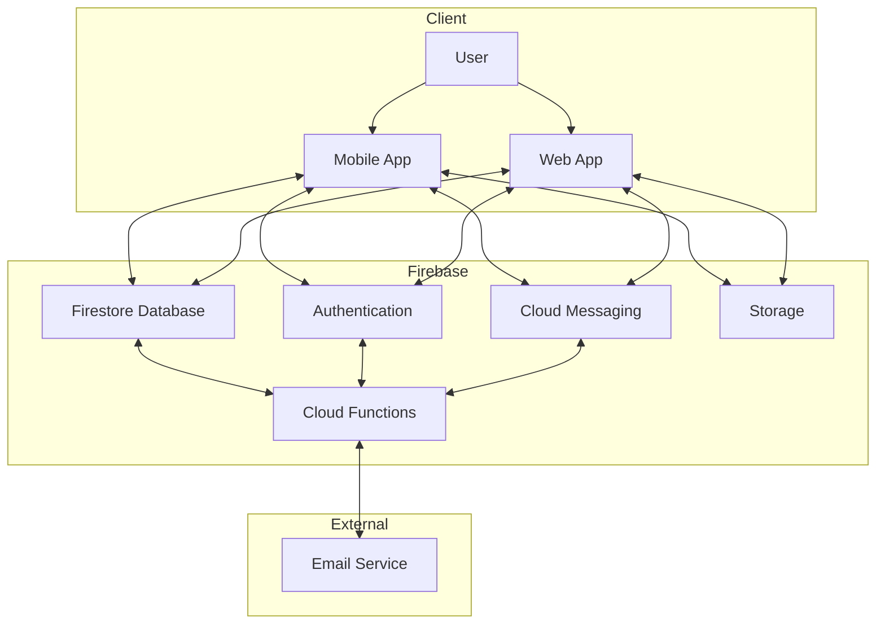
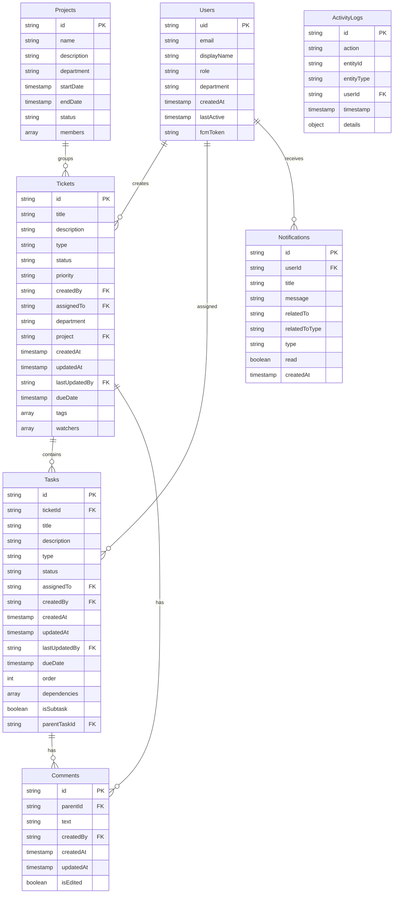

# Complete Ticketing System Documentation

---

## Project Scope and Overview

This documentation provides a comprehensive guide for developing a two-level hierarchical ticketing system with the following core components:

- **Employee Authentication:** Secure login and role-based access control  
- **Ticket Management:** Creation, tracking, and resolution of tickets  
- **Task Management:** Granular task tracking within tickets  
- **User Role Personalization:** Different views and permissions based on user roles  

The system will be built using **Flutter** for cross-platform support and **Firebase** as the backend infrastructure.

---

## System Requirements

### Functional Requirements

#### User Management
- **User registration and authentication** via Firebase Auth
- **Role-based access** (Admin, Manager, Employee)
- **Profile management** with personal details
- **Department assignment** for organizational structure

#### Ticket Management
- **Create, view, and edit tickets** (no deletion functionality)
- **Categorization by ticket types:** Bug, Feature Request, Support, Maintenance
- **Status workflow tracking:** New, In Progress, On Hold, Resolved, Closed
- **Priority assignment:** Low, Medium, High, Critical
- **Department/category assignment** for routing
- **Due date tracking** and SLA monitoring
- **Project grouping capability**
- **Ticket assignment** to specific users

#### Task Management
- **Tasks directly linked** to parent tickets
- **Task types:** Development, Testing, Documentation, Research
- **Task status workflow:** Todo, In Progress, Review, Done
- **User assignment** for accountability
- **Due date tracking** for timely completion
- **Dependency tracking** between related tasks
- **Subtask support** for breaking down complex items

#### Notification System
- **In-app notifications** for updates
- **Email notifications** for critical changes
- **Push notifications** via Firebase Cloud Messaging

#### Reporting & Analytics
- **User performance metrics**
- **Ticket resolution time tracking**
- **Status transition analytics**
- **Daily statistical reporting**

### Non-Functional Requirements
- **Performance:** Fast response times (< 2 seconds) for all operations
- **Scalability:** Support for growing user base and ticket volume
- **Reliability:** 99.9% uptime for critical functions
- **Security:** Role-based access control and data encryption
- **Usability:** Intuitive UI with responsive design for all devices
- **Offline Support:** Basic functionality when network is unavailable

---

## Technical Architecture

### Technology Stack
- **Frontend:** Flutter (cross-platform for iOS, Android, and web)
- **Backend:** Firebase
  - **Cloud Functions** for serverless backend logic
  - **Firestore** for NoSQL database
  - **Authentication** for user management
  - **Cloud Messaging** for push notifications
  - **Storage** for file attachments

### System Architecture Diagram
**Ticketing System Architecture**  


### Database Schema

#### Firestore Collections Structure
**Database Schema Diagram**  



#### Detailed Collection Descriptions

**Users Collection**  
Path: `users/{userId}`  
- `uid: string` (primary key)
- `email: string`
- `displayName: string`
- `role: string` (admin, manager, employee)
- `department: string`
- `createdAt: timestamp`
- `lastActive: timestamp`
- `fcmToken: string` (optional)

**Tickets Collection**  
Path: `tickets/{ticketId}`  
- `title: string`
- `description: string`
- `type: string` (bug, feature, support, maintenance)
- `status: string` (new, inProgress, onHold, resolved, closed)
- `priority: string` (low, medium, high, critical)
- `createdBy: string` (userId)
- `assignedTo: string` (userId)
- `department: string`
- `project: string` (projectId)
- `createdAt: timestamp`
- `updatedAt: timestamp`
- `lastUpdatedBy: string` (userId)
- `dueDate: timestamp`
- `tags: array of strings`
- `watchers: array of userIds`

**Tasks Collection**  
Path: `tickets/{ticketId}/tasks/{taskId}`  
- `title: string`
- `description: string`
- `type: string` (development, testing, documentation, research)
- `status: string` (todo, inProgress, review, done)
- `assignedTo: string` (userId)
- `createdBy: string` (userId)
- `createdAt: timestamp`
- `updatedAt: timestamp`
- `lastUpdatedBy: string` (userId)
- `dueDate: timestamp`
- `order: number` (for sorting)
- `dependencies: array of taskIds`
- `isSubtask: boolean`
- `parentTaskId: string` (taskId, if isSubtask is true)

**Comments Collection**  
Paths:  
- `tickets/{ticketId}/comments/{commentId}`  
- `tickets/{ticketId}/tasks/{taskId}/comments/{commentId}`  
Fields:  
- `text: string`
- `createdBy: string` (userId)
- `createdAt: timestamp`
- `updatedAt: timestamp`
- `isEdited: boolean`

**Notifications Collection**  
Path: `users/{userId}/notifications/{notificationId}`  
- `title: string`
- `message: string`
- `relatedTo: string` (ticketId or taskId)
- `relatedToType: string` (ticket or task)
- `type: string` (assignment, mention, status_change, etc.)
- `read: boolean`
- `createdAt: timestamp`

**ActivityLogs Collection**  
Path: `activityLogs/{logId}`  
- `action: string`
- `entityId: string` (ticketId or taskId)
- `entityType: string` (ticket or task)
- `userId: string`
- `timestamp: timestamp`
- `details: map`

**Projects Collection**  
Path: `projects/{projectId}`  
- `name: string`
- `description: string`
- `department: string`
- `startDate: timestamp`
- `endDate: timestamp`
- `status: string`
- `members: array of userIds`

---

## Development Phases

### Phase 1: Project Setup and Initial Configuration

#### Create Firebase Project
- Set up new Firebase project
- Configure authentication methods
- Set up Firestore database
- Initialize Cloud Functions

#### Create Flutter Project
- Initialize Flutter project
- Configure dependencies
- Set up project structure
- Implement Firebase integration

#### Implement Authentication
- User registration flow
- Login functionality
- Role-based authorization
- Password reset functionality

### Phase 2: Core Functionality Development

#### User Management
- Create user profile screens
- Implement role management
- Set up department assignments
- Profile editing functionality

#### Ticket Management
- Create ticket listing views
- Implement ticket creation forms
- Build ticket detail screens
- Implement status workflow
- Set up priority handling
- Develop assignment functionality

#### Task Management
- Create task board views
- Implement task creation
- Set up status transitions
- Implement assignment functionality
- Build dependency tracking
- Set up subtask functionality

### Phase 3: Advanced Features

#### Notification System
- Set up in-app notifications
- Implement email notifications
- Configure push notifications
- Create notification preferences

#### Reporting & Analytics
- Build dashboard views
- Implement metrics calculations
- Create report generation
- Set up export functionality

#### Project Management
- Create project creation interface
- Implement project-based views
- Set up project member management
- Configure ticket grouping

### Phase 4: Testing and Deployment

#### Unit Testing
- Test individual components
- Validate business logic
- Test authentication flow

#### Integration Testing
- Test component interactions
- Validate workflow processes
- Test Firebase integration

#### User Acceptance Testing
- Get feedback from stakeholders
- Refine UI/UX based on feedback
- Fix identified issues

#### Deployment
- Prepare production environment
- Deploy to app stores
- Configure web deployment
- Set up monitoring

---

## Frontend Implementation Details

### Project Structure
```

lib/
  ├── main.dart
  ├── app.dart
  ├── config/
  │   ├── routes.dart
  │   ├── themes.dart
  │   └── constants.dart
  ├── models/
  │   ├── user.dart
  │   ├── ticket.dart
  │   ├── task.dart
  │   └── project.dart
  ├── services/
  │   ├── auth_service.dart
  │   ├── ticket_service.dart
  │   ├── task_service.dart
  │   └── notification_service.dart
  ├── providers/
  │   ├── auth_provider.dart
  │   ├── ticket_provider.dart
  │   └── task_provider.dart
  ├── screens/
  │   ├── auth/
  │   ├── dashboard/
  │   ├── tickets/
  │   ├── tasks/
  │   └── settings/
  └── widgets/
      ├── common/
      ├── ticket/
      └── task/
```

### Key UI Components

#### Authentication Screens
- **Login screen**
- **Registration screen**
- **Password reset screen**
- **Profile setup screen**

#### Dashboard
- **Overview statistics**
- **Recent activities**
- **Quick actions**
- **Personalized views** based on user role

#### Ticket Management
- **Ticket list** with filters
- **Ticket creation form**
- **Ticket detail view**
- **Ticket status workflow buttons**
- **Comment section**

#### Task Management
- **Kanban board view**
- **Task creation form**
- **Task detail view**
- **Dependency visualization**
- **Subtask management**

### UI Wireframes
- **Dashboard Wireframe:** [Click to open image](#) | [Tap to open](#)
- **Ticket Detail Wireframe:** [Click to open image](#) | [Tap to open](#)

---

## Backend Implementation Details

### Firebase Cloud Functions

#### Task Assignment Notification
- **Triggers:** When a task's `assignedTo` field changes
- **Actions:**  
  - Creates notification for assigned user  
  - Sends push notification if FCM token is available

#### Ticket Status Change Tracking
- **Triggers:** When a ticket's status changes
- **Actions:**  
  - Logs activity in the activity log  
  - Notifies relevant stakeholders (creator, watchers)

#### Automatic Ticket Status Updates
- **Actions:**  
  - Updates ticket status based on tasks completion  
  - Marks ticket as resolved when all tasks are done  
  - Updates ticket to "In Progress" when the first task starts

#### Daily Statistics Generation
- **Schedule:** Runs every 24 hours
- **Actions:**  
  - Calculates ticket and task statistics  
  - Stores data for dashboard reporting

### Security Rules

```firestore
service cloud.firestore {
  match /databases/{database}/documents {
    // Users can read their own data
    match /users/{userId} {
      allow read: if request.auth.uid == userId;
      allow write: if request.auth.uid == userId && request.resource.data.role == resource.data.role;
    }
    
    // Ticket access rules
    match /tickets/{ticketId} {
      allow read: if request.auth != null;
      allow create: if request.auth != null;
      allow update: if request.auth != null && 
                     (resource.data.createdBy == request.auth.uid || 
                      resource.data.assignedTo == request.auth.uid ||
                      get(/databases/$(database)/documents/users/$(request.auth.uid)).data.role == 'admin' ||
                      get(/databases/$(database)/documents/users/$(request.auth.uid)).data.role == 'manager');
    }
    
    // Tasks inside tickets
    match /tickets/{ticketId}/tasks/{taskId} {
      allow read: if request.auth != null;
      allow write: if request.auth != null && exists(/databases/$(database)/documents/tickets/$(ticketId));
    }
    
    // Comments
    match /tickets/{ticketId}/comments/{commentId} {
      allow read: if request.auth != null;
      allow create: if request.auth != null;
      allow update, delete: if request.auth != null && resource.data.createdBy == request.auth.uid;
    }
    
    match /tickets/{ticketId}/tasks/{taskId}/comments/{commentId} {
      allow read: if request.auth != null;
      allow create: if request.auth != null;
      allow update, delete: if request.auth != null && resource.data.createdBy == request.auth.uid;
    }
  }
}
```

